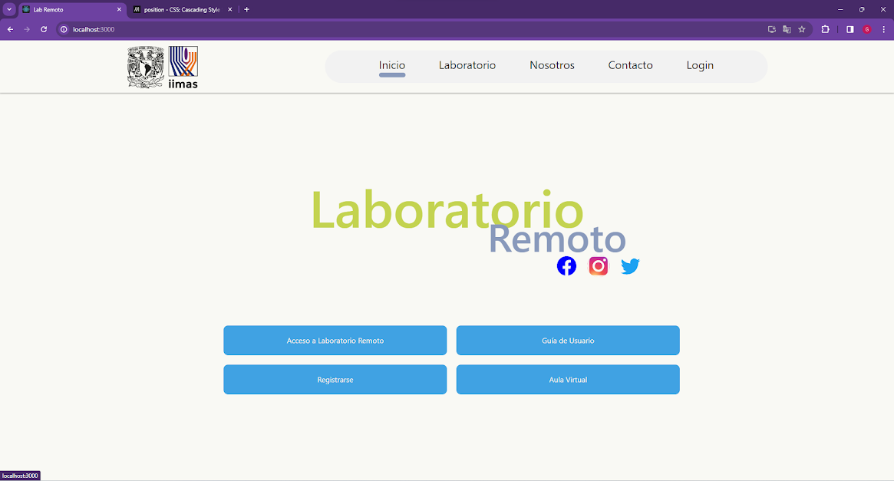

# Remote Laboratory by IMASS
 

<!-- TABLE OF CONTENTS -->

  
Table of Contents

  <ol>
    <li><a href="#about-the-project">About The Project</a></li>
    <li><a href="#Folder Structure">Folder Structure </a></li>
    <li><a href="#authors">Authors</a></li>
    <li><a href="#acknowledgments">Acknowledgments</a></li>
  </ol>

## About The Project
This project focuses on the design and implementation of an innovative remote laboratory tailored for students. It enables users to interact with real hardware components and systems via an online platform, delivering a hands-on educational experience without the spatial limitations of a traditional lab.

The lab is composed of three core elements: the user interface, the server, and the physical setup. Through the interactive interface, students can add or remove components such as actuators, sensors, microprocessors, SoCs, and FPGAs. They can create circuit connections, program hardware boards, observe real-time system behavior, load pre-designed practice templates from instructors, save their progress, and share circuit configurations via links.

At the core of the system, the server manages synchronization, offers web services, stores data, orchestrates ROS nodes, and handles infrastructure tasks. This ensures a smooth, reliable, and user-friendly experience, granting students easy access to high-quality learning tools.

The physical setup features a variety of actuators, sensors, and a six-degree-of-freedom collaborative robot (cobot), forming the experimental platform for practical exercises. This setup empowers students to design, program, and test real-world systems, reinforcing their knowledge in key areas of engineering and technology.

By integrating all these elements, the remote lab becomes a powerful educational resource—bridging theory and practice, and fostering the development of essential skills for engineering and computer science students, all within a fully remote and accessible environment.

 

## Folder Structure 

1. Frontend
   -  Web
   - Workspace
2. Backend
   - Web
   - Database
   - Orchestrator 
3. Hardware
   - Boards
   - Actuators
   - Lights
   - Sensors
   - Power
   - Net

## Authors

- Victor M. Lomas Barrie
- Humberto Gómez naranjo
- Ricardo Villarreal
- Roberto Tovar Medina
- Tamara Iskra Alcántara Concepción
- Gaspar Lorenzo Collado Santes
- Félix Alberto Nieto García
- Abner Maya Vergara
- Jorge Alejandro Sobrevilla Zarazúa
- Oscar Gabriel Hernández Armenta
- Abraham Ramírez Hernández
- Victor M. Lomas Barrie
- Eliseo Díaz
- Sergio Padilla Reynaud
- Jorge Alejandro Sobrevilla Zarazúa
- Julio Alejandro Serrepe Ramírez
- Kristian Leonel Benítez Pérez
- Ángel Jared Núñez Bonilla
- Oscar Durán
- Werner Yahir Villanueva Villa
- Sergio Alberto Camacho Molina
- Abner Maya Vergara

## Acknowledgments

The support to the Project Support Programa de Apoyo a Proyectos para Innovar y Mejorar la Educación (PAPIME), perteneciente a la Dirección General de Asuntos del Personal Académico (DGAPA), de la Universidad Nacional Autónoma de México (UNAM), is appreciated through financing the project with code PE109724
