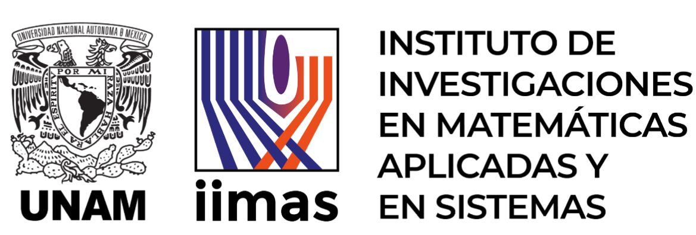

 

# Remote Laboratory by IMASS

<!-- TABLE OF CONTENTS -->

  
Table of Contents

  <ol>
    <li><a href="#about-the-project">About The Project</a></li>
    <li><a href="#getting-started">Getting Started</a></li>
    <li><a href="#usage">Usage</a></li>
    <li><a href="#roadmap">Roadmap</a></li>
    <li><a href="#contributing">Contributing</a></li>
    <li><a href="#license">License</a></li>
    <li><a href="#contact">Contact</a></li>
    <li><a href="#acknowledgments">Acknowledgments</a></li>
  </ol>

## About The Project
The project is about the implementation and structure of an innovative remote laboratory designed for students. The project enables users to interact with real components and systems through an online platform, providing a practical educational experience without the geographical limitations of a traditional physical lab. Comprising three main elements—the user interface, server, and physical setup—the lab offers an interactive interface allowing students to add and remove components such as actuators, sensors, microprocessors, SoCs, and FPGAs. Users can make connections, program cards, view real-time behavior, load practice templates provided by instructors, save progress, and share circuit links.

The server plays a crucial role in synchronizing activities, providing web services, data storage, ROS node orchestration, and infrastructure management, ensuring a seamless and accessible learning experience with access to high-quality educational resources.

The physical setup, equipped with various actuators, sensors, and a 6-degree-of-freedom cobot, serves as the practical component for conducting experiments. This setup allows students to design, program, and experiment with real systems, enhancing learning in key engineering and technology areas. The integration of these elements makes the lab a powerful educational tool, offering a comprehensive practical and theoretical experience, fostering the development of essential skills and knowledge for engineering and computer science students in a remote and accessible environment.

## Folder Structure 

1. Frontend
   -  Web
   - Workspace
2. Backend
   - Web
   - Database
   - Orchestrator 
3. Hardware
   - Boards
   - Actuators
   - Lights
   - Sensors
   - Power
   - Net

## Software and Hardware

| Name | Description | Version |
|--- |--- | --- |
| [ROS](https://www.ros.org/) | The Robot Operating System (ROS) is a set of software libraries and tools that help you build robot applications. | Humble |
| [Python](https://www.python.org/) |Python is a programming language that lets you work quickly and integrate systems more effectively. | 3.8 |
|[Django](https://www.djangoproject.com/) | Django is a high-level Python web framework that encourages rapid development and clean, pragmatic design. | |
|[React](https://es.react.dev/) |React is the library for web and native user interfaces. Build user interfaces out of individual pieces called components written in JavaScript. |
|[Proxmox ](https://www.proxmox.com/en/) |Proxmox Virtual Environment is a complete open-source platform for enterprise virtualization. | |
|[Arduino](https://www.arduino.cc/) | Open-source electronic prototyping platform enabling users to create interactive electronic objects. | |
|[Vivado](https://www.xilinx.com/products/design-tools/vivado.html) |Vivado is the design software for AMD adaptive SoCs and FPGAs.  | |
|[Ise xilinx](https://www.xilinx.com/products/design-tools/ise-design-suite.html) |ISE™ WebPACK™ design software is the industry´s only FREE, fully featured front-to-back FPGA design solution f| |

## Authors

- Victor M. Lomas Barrie
- Humberto Gómez naranjo
- Ricardo Villarreal
- Roberto Tovar Medina
- Tamara Iskra Alcántara Concepción
- Gaspar Lorenzo Collado Santes
- Félix Alberto Nieto García
- Abner Maya Vergara
- Jorge Alejandro Sobrevilla Zarazúa
- Oscar Gabriel Hernández Armenta
- Abraham Ramírez Hernández

<!-- ACKNOWLEDGMENTS -->
## Acknowledgments
